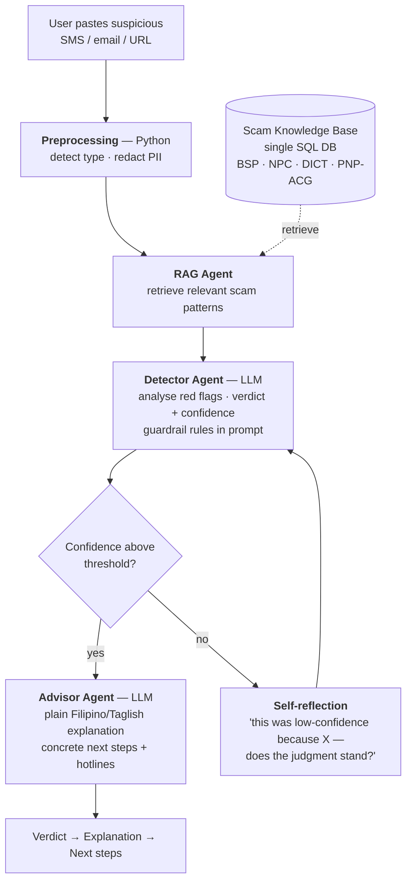

# Capstone Mentor Consultation #2 — Elderly Scam Shield (Jul 29)

**Date:** 2026-07-29, 18:06–18:46 (~40 min of the 6:00–8:00 PM slot) · Microsoft Teams
**Mentor:** Rozelle Samonte (Accenture) — her first time mentoring a student team
**Team present:** Aki (Lead), Nian (Domain) presenting; other groupmates could not join

This is the **outcome** note for the consultation prepped in [[2026-07-29-capstone-consultation-prep|the prep note]]. Four of the open questions got a ruling and the architecture changed as a result: **a RAG agent was added**, **the standalone Guardrail node was removed**, and **the retry loop became a self-reflection loop**. The language and model-selection questions from the prep list were only partly answered — the mentor has no Filipino-language project experience to draw on, so the bake-off plan survives untouched.

> Sourcing note: the source is a Zoom-style auto-transcript with unreliable speaker attribution — labels swap mid-sentence — and heavy Taglish garbling. Speaker 3 is the mentor throughout; Speaker 1 is Aki; Speaker 2 is Nian (identifies himself as the domain expert). "Landgraf" / "land graph" / "Lang's graph" is LangGraph; "fed backflies" is Bedrock. Rulings below are paraphrased from those turns, not quoted verbatim.

---

## What the team presented

- **Concept re-brief** — the mentor had not seen the July 15 scope, so the first ~6 minutes re-covered the one-liner, the problem, and the three outputs (identify → explain → next steps).
- **Hard-coded UI prototype**, explicitly labelled early-development, with two sample scams: a **parcel-on-hold / unpaid-balance** smishing text and a **GCash account-verification** text. Each returns a verdict, a rating, concrete next actions, an explanation of what makes it a scam, and similar scams.
- **Tech stack as of today:** React/TypeScript front end · Python + FastAPI back end · LangGraph agent framework · **LLM provider undecided** · Supabase vector store · embeddings undecided. Postgres was floated for the knowledge base.
- **Dataset find** — a Philippine spam/marketing SMS dataset on Kaggle: one user's received messages collected over several years, with message text, category, and receipt date; some fields redacted because they contained OTPs and other private data.

> Sourcing note: the transcript renders the dataset host as "Cargill" and the dataset as "PHFAM Marketing SMS". Read as **Kaggle** and **PH spam/marketing SMS** — consistent with the Kaggle lead in the prep note, but not literally in the transcript.

---

## Rulings

| # | Question asked | Mentor's ruling |
|---|---|---|
| 1 | Is **LangGraph** the right framework, or overkill? | Framework choice is mostly a **syntax** difference — the general structure of an agentic solution is the same across frameworks, like picking between programming languages. Pick whatever makes it easiest to build the solution you need. Personally: LangGraph is a good agentic framework for this. **→ LangGraph stays.** |
| 2 | Which model handles **English + Tagalog** best? | No Filipino-specific experience — language handling has been out of scope on her projects. Closest analogue: a product-recommendation system that personalised by locale (Spanish for users in Spain), built on GPT-4 and later migrated to GPT-5. Her read: **any LLM has a good grasp of language**; the binding constraint is which model you can actually access. |
| 3 | Do we need **RAG**, or is a plain database enough? | RAG is worth it here. Regex/code pattern-matching has obvious pitfalls — what happens when the message doesn't match exactly, or the scammers use an entirely new script? RAG matches on **intent** and can return "this pattern may be relevant to you." **→ RAG stays.** |
| 4 | Where does retrieval sit in the graph? | Add a **separate RAG agent between preprocessing and the Detector**, whose job is to find the relevant patterns and pass them to the Detector as context. **→ New node.** |
| 5 | Is a RAG agent feasible for us to build? | Yes — and easier given the team has Claude available to build with. |
| 6 | What should the **low-confidence retry** actually do? | **Not** re-run from step 1 — the output will be the same and adds no value to the agent. Use **self-reflection**: on low confidence, enhance the prompt — state that the previous output was low-confidence and why, then ask the agent to re-analyse against the same context and say whether the judgment stands. A feedback loop inside the agent. |
| 7 | Should the **guardrail be its own node/agent**? | No — **build it into the Detector agent.** Two mechanisms: (a) Python threshold check — below, say, 70%, retry, which the retry logic already covers; (b) prompt engineering — guidelines or "strictly follow these rules" inside the agent's own prompt. **→ Standalone Guardrail node removed on the call; mentor confirmed "yes, build it in."** |
| 8 | How should the **knowledge base be stored**? | A **single SQL database with the data sources as tables**. Cleaner than CSVs, which force the RAG step to jump between separate files. |

### Unprompted mentor concern — copy-paste can trigger the link

Flagged by the mentor before the question list, and **new** relative to everything in the July 15 and prep notes:

> If the target user is elderly and not tech-confident, the act of **long-pressing a scam SMS to copy it** carries a real chance of accidentally opening the URL — the exact outcome the product exists to prevent.

She framed it as "far-fetched, but something to consider" and asked for a mitigation idea. The team's response: accept more input types than copy-paste — a **screenshot of the text message** was floated (OCR), and **voice input** was raised and immediately judged out of scope. Nothing was decided. This is now an open item.

### Prompt engineering — the standing advice

The mentor spent the longest single stretch of the call here, unprompted by any question:

- Be **clear, specific, and concise**. People overlook prompt engineering as "just sentences you send to the AI."
- **Both directions hallucinate.** Too little guidance → it hallucinates. Too much context → it hallucinates too. (Aki named this "context rot"; the mentor agreed.)
- **Read the prompt documentation for the model you actually pick.** Different LLMs have different prompt patterns, and **agentic prompting has its own formats** — not the same as typing a request into ChatGPT.
- **AWS Bedrock specifically** needs you to say *what* to do **and** *how* to do it. Give it a vague instruction like "make it purple" and it will take the most convoluted route there, burning tokens and hallucinating along the way.

---

## Provider constraint — Bedrock

The Accenture student sandbox provides **AWS Bedrock** and, as far as the call established, only Bedrock. The mentor's own view of it was blunt: she does not like it, it is not that strong (*"hindi siya ganun ka strong"*). Her recommendation if the team can get access to something better: **GPT or Gemini — either is good**; **Claude (Opus / Sonnet)** also fine.

Bedrock does host Claude, so the "Claude is available" and "we only have Bedrock" statements are not in conflict — but which specific models the sandbox exposes was never established on the call. Worth pinning down before the bake-off. `[GK]`

This sharpens rather than resolves the model question: the [[../topics/llm-api-providers|LLM API Providers]] data-residency argument for a locally-run SEA model still stands, and the mentor never heard it — SEA-LION and SeaLLM did not come up.

---

## Architecture after this consultation

Five stages, three of them LLM agents.

| Node | Type | Role | Change |
|---|---|---|---|
| **Preprocessing** | Python | Detect message type (SMS / email / URL); redact PII before anything reaches an LLM | unchanged — mentor confirmed a non-LLM step is right here |
| **RAG Agent** | LLM + retrieval | Retrieve relevant scam patterns from the KB, pass them to the Detector as context | **added 07-29** |
| **Detector** | LLM agent | Red-flag analysis against the retrieved context; verdict + confidence; guardrail rules live in this prompt; self-reflection loop on low confidence | absorbed the guardrail |
| **Advisor** | LLM agent | Plain Filipino/Taglish explanation naming the red flags, plus concrete next steps and agency hotlines pulled from the KB | unchanged — mentor called it "pretty straightforward" |
| ~~Guardrail~~ | ~~Python~~ | — | **removed 07-29** |

The cycle is still the honest justification for LangGraph over a plain chain — it just changed shape. It is no longer "retry retrieval," it is "reflect on your own low-confidence verdict," which is a genuinely different prompt on the second pass.

---

## Status and admin

- **Planning stage, no development started.** Presentation is in August.
- **Deployment is unresolved and possibly at risk.** The mentor doubted the provided sandbox would let the team deploy, and the team's own read was that the deliverable is "just a presentation." That sits against **capstone requirement #3 — deployed and accessible demo** in [[../_overview|the syllabus requirements]]. Needs confirming with Sir JJ or the course instructor, not the industry mentor.
- **Next session:** next week, arranged through **Sir JJ (Jhay Jhay Soriano)**.
- **Direct channel:** the mentor offered **Messenger** for quick questions (handle `RHSamonte`) and said outright she does not check the email on the invite. Aki added her on the call.
- **Mentor's read on the project:** positive and unhedged — "really timely for us here in the Philippines," "lots of scammers here."
- **Team's own stated challenges:** standing up LangGraph, and prompt engineering across the agents. Committed to reading the LangGraph and AWS Bedrock documentation.

---

## Still open after this consultation

| # | Question | Why it's still open |
|---|---|---|
| 1 | Does the **Advisor merge into the Detector**? | Never asked. Mentor called the Advisor "straightforward" and did not challenge it — treat as tacitly fine, not ruled on. |
| 2 | **Which model**, concretely? | "Whatever you can access," plus a Bedrock warning. The bake-off is still the plan. |
| 3 | **Cross-lingual retrieval** — Taglish query against an English corpus | Not raised. Ran out of runway; SEA models never came up either. |
| 4 | **English \| Tagalog output toggle** | Not raised. When the mentor asked "have we figured out the language," she meant the *programming* language — the answer given was TypeScript. |
| 5 | **Copy-paste triggers the link** — screenshot/OCR input? | New from the mentor. No decision. |
| 6 | **Is a deployed demo actually possible** in the sandbox? | New. Course-side question, not a mentor question. |
| 7 | **Evaluation data** | Partly answered by the Kaggle PH SMS dataset. Whether it's labelled well enough for an eval set is unverified. |

---

## Action Items

| Owner | Task |
|---|---|
| Allen (Tech) | Rework the LangGraph skeleton to the five-stage shape: add the RAG agent node, delete the Guardrail node, replace the retry edge with a self-reflection prompt. |
| Nian (Domain) | Move the KB into a **single SQL database with one table per source**. Verify the Kaggle PH SMS dataset's licence and label quality. |
| Aki (Lead) | Confirm which models the Accenture Bedrock sandbox actually exposes, then run the bake-off. Separately, confirm with Sir JJ whether a deployed demo is required and possible. |
| James (UX) / Lui (Scribe) | Design a mitigation for the accidental-link-tap risk — screenshot/OCR input is the leading candidate. Keep the `English \| Tagalog` toggle in the mockup; it was never ruled against. |
| All | Read the LangGraph docs and the prompt-format documentation for whichever model is chosen. |

---

## Links to Topics

- [[../topics/capstone-elderly-scam-shield|Capstone — Elderly Scam Shield]] — canonical proposal, updated with everything above
- [[../topics/langchain-langgraph|LangChain & LangGraph]] — the framework-choice ruling
- [[../topics/agentic-ai|Agentic AI]] — self-reflection loops, guardrails inside agents
- [[../topics/prompt-engineering|Prompt Engineering]] — the both-directions hallucination point, Bedrock specificity
- [[../topics/llm-api-providers|LLM API Providers]] — Bedrock as the sandbox constraint
- [[../_overview|STSP001 Overview]]

## See Also

- [[2026-07-29-capstone-consultation-prep|Consultation Prep (2026-07-29)]] — the questions this session was answering
- [[2026-07-15-capstone-mentor-consultation|Mentor Consultation (2026-07-15)]] — original scoping
- [[2026-06-13-group-formation|Group Formation]] — team + roles
