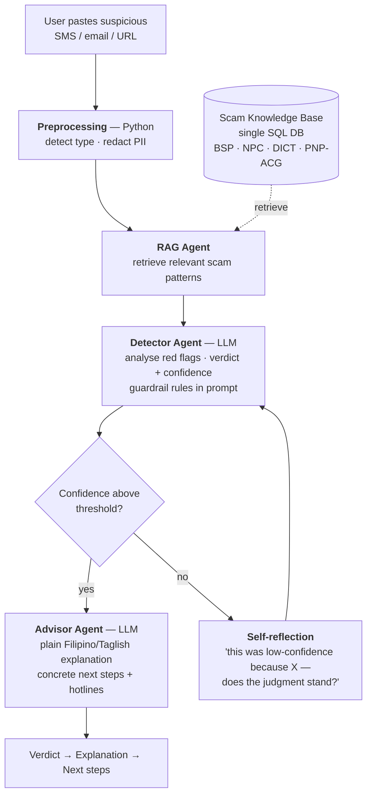

# Capstone — Elderly Scam Shield

Canonical living proposal for the STSP001 capstone. The team committed to this idea (Plan #3 from the June 13 rough-plans comparison), refined its scope with a mentor on 2026-07-15, and revised the architecture twice on 2026-07-29 — once by the team ahead of the second mentor consultation ([[../notes/2026-07-29-capstone-consultation-prep|prep note]]), then again **during** that consultation ([[../notes/2026-07-29-capstone-mentor-consultation|outcome note]]). The architecture below is the post-consultation shape.

## One-line

A web app where an elderly Filipino (or a family caregiver) pastes a suspicious SMS, email, or URL and gets, in plain Filipino/Taglish or English, a **verdict → detailed explanation → next steps**, powered by a **LangGraph** pipeline over a **curated PH scam-pattern knowledge base**.

## Main Objectives

1. **Identify** whether a message is a scam and classify its pattern.
2. **Explain** the verdict in plain Filipino/Taglish, naming the red flags.
3. **Recommend next steps** — don't click, block, verify via official hotline, report to NPC/PNP-ACG.
4. Ship a **deployed prototype** with a **multi-agent (LangGraph)** architecture over a curated **knowledge base**.
5. Document **guardrails + failure modes**, with focus on safe behavior on sample messages.

## Scope

**In:** paste-in text / email / URL (Filipino/English/Taglish); identify→explain→next-steps output; LangGraph retrieve→detect→advise pipeline with a confidence-gated self-reflection loop; curated PH scam knowledge base; **English/Tagalog output toggle**; elderly-accessible UI; guardrail + failure-mode docs; labeled scam/legit eval set.

**Out (this term):** voice / text-to-speech; telco / network-level integration; real-time on-device interception; live threat feeds; languages beyond Filipino/English/Taglish. Voice/TTS and telco adoption are **future work**, presented not built.

**Undecided:** whether **screenshot / OCR input** joins copy-paste as an accepted input — see the accidental-tap risk below.

## Limitations

- Cannot catch every novel/adversarial scam; freshness date shown in UI.
- Guardrails on edge/sample inputs are the hard part (mentor-flagged); never claims 100% certainty; always recommends independent verification.
- False positives/negatives are inherent; rubric defines thresholds.
- Privacy: users may paste OTPs/account numbers — warn, redact before the LLM call, and never log raw inputs.
- **Cross-lingual retrieval** is a known weak point — see [Knowledge Base](#knowledge-base) below.
- **The input method is itself a risk.** Long-pressing a scam SMS to copy it can accidentally open the URL — the exact outcome the product exists to prevent, in the exact population least equipped to recover from it. Raised unprompted by the mentor on 2026-07-29. Screenshot/OCR input is the leading mitigation; voice input was raised and ruled out of scope.
- **A deployed demo may not be possible** in the provided Accenture sandbox, which would conflict with capstone requirement #3. Open with the course side, not the industry mentor.

---

## Architecture (LangGraph)

Mentor-confirmed 2026-07-29. Three LLM agents behind a deterministic Python front end. Retrieval is its own agent; the guardrail is not a node at all.

| Node | Type | Role |
|---|---|---|
| **Preprocessing** | Python | Detect message type (SMS / email / URL); strip and redact PII before anything reaches an LLM |
| **RAG Agent** | LLM + retrieval | Find the scam patterns relevant to this message and hand them to the Detector as context |
| **Detector** | LLM agent | Analyse red flags against the retrieved context, emit verdict + confidence. Guardrail rules live in this prompt. The core of the product. |
| **Advisor** | LLM agent | Plain Filipino/Taglish (or English) explanation naming the red flags, plus concrete next steps and agency hotlines drawn from the KB |

### In LangGraph terms

- **Nodes** — `preprocess`, `retrieve`, `detect`, `advise`
- **Conditional edge** — after `detect`, branch on confidence: proceed to `advise`, or loop back into `detect` carrying a **self-reflection prompt** rather than a plain re-run
- **Shared state** — redacted message text, detected message type, retrieved KB patterns, verdict, confidence score, prior low-confidence reason, reflection count
- **Not in state** — the raw unredacted user input, per the privacy limitation

The cycle is still the justification for LangGraph over a plain chain: cycles are the thing chains cannot express.

### Guardrails are not a node

Mentor ruling, 2026-07-29: **build the guardrail into the Detector agent**, two ways at once.

1. **Python threshold** — below a defined confidence (she used 70% as the example), don't emit; loop. Same machinery as the retry, so the conditional edge already covers it.
2. **Prompt engineering** — the never-claim-100% rule, the citation requirement, and the "ask a trusted family member" fallback go into the Detector's own prompt as explicit guidelines, framed as rules to strictly follow.

A separate guardrail node would be either a third LLM round-trip or a redundant Python pass over work the Detector already did.

### Retry ≠ re-run

Also mentor-ruled. Re-running the Detector from step 1 on low confidence produces the same output and adds no value to the agent. The second pass has to differ: state back to the agent that the previous output was low-confidence **and why**, then ask it to re-analyse against the same retrieved context and say whether the judgment stands. That is **self-reflection** — a feedback loop inside the agent, not a retry around it. See [[agentic-ai|Agentic AI]].

### Change history — 2026-07-29

Two revisions on the same day.

**Morning (team, pre-consultation).** The July 15 design had four LLM agents — Classifier, Investigator, Advisor, Safety. The **Classifier was removed**: message-type detection is a `startswith("http")`-class check that does not justify an LLM call, and it moved to Python preprocessing. The Investigator was renamed **Detector**.

**Evening (mentor consultation).** Retrieval was split out of the Detector into its own **RAG agent**; the **Guardrail node was deleted** and folded into the Detector prompt; the retry edge became a **self-reflection** edge. Net: back up to three LLM agents, but a different three, and each one mentor-justified rather than assumed. Still clears the capstone rubric's "at least 2 distinct agent roles or pipeline stages."

---

## Language Design

**The app outputs both English and Tagalog, chosen by a user-facing toggle — not by language detection.**

Nothing in the pipeline identifies whether the input is Filipino, English, or Taglish. The LLM handles code-switched input natively without being told what it is reading, and the output language is a fixed product choice rather than something derived from the input. `[GK]` Standard language-detection libraries also handle Taglish poorly, since code-switching is their known weak spot.

An `English | Tagalog` toggle above the result costs one prompt instruction, has no detection step to get wrong, and serves both users in the target market — a caregiver screening on someone's behalf may want English while the elderly user wants Tagalog.

**Register is a separate and larger risk than language.** Formal "deep Tagalog" is often harder for Filipinos to read than Taglish — words like *panganib* or *pagpapatunay* belong to textbooks rather than to speech. `[GK]` A model instructed to "reply in Tagalog" will drift toward that formal register, which is the opposite of accessible. The Advisor prompt must specify register explicitly; the target is the "plain Filipino/Taglish" wording from the July 15 scope, not literary Tagalog.

---

## Model Selection

**Approach: a bake-off, not a spec-sheet comparison.** Ten real scam messages run through three candidate models, with a native speaker ranking the Tagalog output on naturalness and register — does it read like a person or like a government memo? Scoring covers: natural Taglish vs. stilted formal Tagalog · red flag named clearly · next step actionable · unintended English leakage mid-sentence.

The 2026-07-29 mentor consultation did **not** narrow this. Asked which model handles English + Tagalog best, the mentor had no Filipino-specific experience — language handling had been out of scope on her Accenture projects. Her closest analogue was a product-recommendation system that personalised by locale (Spanish for users in Spain), built on GPT-4 and later migrated to GPT-5. Her position: **any LLM has a good grasp of language; the binding constraint is which model you can actually access.** The bake-off therefore survives as the team's answer to "how did you choose your model."

**The real constraint is the sandbox.** The Accenture student environment provides **AWS Bedrock**, and the mentor's own assessment of it was blunt — she does not like it, it is not that strong (*"hindi siya ganun ka strong"*). Her recommendation if better access is obtainable: **GPT or Gemini, either is good**; **Claude (Opus / Sonnet)** also fine. Bedrock does host Claude, so "we have Claude" and "we only have Bedrock" are not in conflict — but **which models the sandbox actually exposes was never established** and needs pinning down before the bake-off can run. `[GK]`

Candidates. **All `[GK]` — model availability moves quickly; verify before citing any of these:**

| Candidate | Rationale |
|---|---|
| Frontier models (GPT / Claude / Gemini) | All produce Tagalog; the open question is register quality, not raw capability |
| **SEA-LION** (AI Singapore) | Purpose-built for Southeast Asian languages including Filipino |
| **SeaLLM** (Alibaba DAMO) | Same category — Southeast Asian language family |

The two SEA models connect to [[llm-api-providers|LLM API Providers]]: a locally-run SEA model is a real answer to the Data Privacy Act concern about routing Filipino users' SMS to a US endpoint. Neither SEA-LION nor SeaLLM came up on 2026-07-29 — the session ran out of runway before the data-residency angle was raised, so it is still unaired with a mentor.

> The four-question model-selection framework in [[llm-ecosystem|LLM Ecosystem]] — data residency, capability, fine-tuning, cost — does **not** include language. That omission is precisely where this project sits.

---

## Knowledge Base

Curated PH scam-pattern corpus: BSP scam advisories, NPC privacy alerts, DICT cyber-scam advisories, PNP-ACG + BSP public scam templates, bank fraud advisory pages, and a scam-tactics taxonomy (phishing/smishing/vishing/romance/OFW/investment/package-delivery). Plus real scam examples — the team located a Philippine spam/marketing SMS dataset on Kaggle: one user's received messages over several years, with message text, category, and receipt date, partly redacted where messages contained OTPs. `[GK]` Licence and label quality unverified.

**Storage: a single SQL database, one table per data source.** Mentor ruling, 2026-07-29. Cleaner than a pile of CSVs, which force the retrieval step to jump between separate files. This supersedes nothing in the tech stack — Supabase is Postgres — but it does settle the shape.

**RAG is confirmed, and it is its own agent.** The mentor's argument was concrete: a regex or code pattern-matching approach has obvious pitfalls — what happens when a message doesn't match exactly, or the scammers write an entirely new script? RAG matches on **intent**, and can return "this pattern may be relevant to you" for messages it has never seen. That is precisely the failure mode the product cannot afford.

**The corpus is bilingual and lopsided.** The authoritative sources are written largely in English; the scam messages themselves are Tagalog/Taglish. A Taglish query therefore has to retrieve English documents — **cross-lingual retrieval**, which is a weaker link than generation, because most embedding models are English-centric and code-switched text is their known weak spot. `[GK]`

Candidate mitigations, in increasing order of effort:

1. Use a multilingual embedding model and accept the quality hit.
2. Have the Detector extract red-flag *concepts* in English first, then retrieve against the English corpus.
3. Store each KB entry with hand-written English and Tagalog keyword fields during curation.

Option 2 is the cheapest good answer, but the choice is still open.

---

## Resolved at the 2026-07-29 consultation

| Question | Ruling |
|---|---|
| Is LangGraph right, or overkill? | **Keep it.** Framework choice is mostly a syntax difference — the structure of an agentic solution is the same across frameworks. Mentor's personal view: LangGraph is a good fit here. |
| Is RAG needed at all? | **Yes**, and as its own agent between preprocessing and the Detector. Pattern-matching breaks on novel scammer scripts; RAG matches on intent. |
| Should the guardrail be an agent? | **Neither agent nor node** — build it into the Detector via a Python confidence threshold plus explicit prompt rules. |
| What should the low-confidence retry do? | **Self-reflection, not re-run.** Feed the failure reason back into the prompt and ask whether the judgment stands. |
| How is the knowledge base stored? | **One SQL database, one table per source.** |

## Open Questions

Still undecided after the second consultation.

| # | Question | Status |
|---|---|---|
| 1 | Does the **Advisor merge into the Detector** — one call emitting verdict + reasons + advice as structured JSON? | Never asked. Mentor called the Advisor "straightforward" and didn't challenge it — tacitly fine, not ruled on. |
| 2 | Which model, concretely? | "Whatever you can access," plus a Bedrock warning. Bake-off still pending; sandbox model list unconfirmed. |
| 3 | **Cross-lingual retrieval** — Taglish query against an English corpus | Not raised on 2026-07-29. |
| 4 | The **English \| Tagalog output toggle** | Not raised. When the mentor asked whether the team had "figured out the language," she meant the *programming* language; the answer given was TypeScript. |
| 5 | **Accidental link tap** — does screenshot/OCR input get added? | New, mentor-raised. No decision. |
| 6 | **Is a deployed demo possible** in the Accenture sandbox? | New. The mentor doubted it; capstone requirement #3 demands it. Course-side question. |
| 7 | Evaluation data | Partly answered by the Kaggle PH SMS dataset. Label quality and licence unverified. |

## Recommendations / Future Work

- **Voice + text-to-speech** for low-vision elderly users.
- **Telco adoption** — network-level message screening as a B2B channel.
- Broader language coverage; continuously-updated threat feed.

## See Also

- [[agentic-ai|Agentic AI]] — multi-agent design foundation, self-reflection loops
- [[langchain-langgraph|LangChain & LangGraph]] — orchestration framework
- [[prompt-engineering|Prompt Engineering]] — where the guardrail rules actually live
- [[llm-ecosystem|LLM Ecosystem]] — model-selection framework
- [[llm-api-providers|LLM API Providers]] — hosted vs local, data residency, Bedrock
- [[../notes/2026-07-15-capstone-mentor-consultation|Mentor Consultation (2026-07-15)]] — original scoping
- [[../notes/2026-07-29-capstone-consultation-prep|Consultation Prep (2026-07-29)]] — question list, positions going in, deck flow
- [[../notes/2026-07-29-capstone-mentor-consultation|Mentor Consultation #2 (2026-07-29)]] — the rulings this page now reflects
- [[../_overview|STSP001 Overview]]
